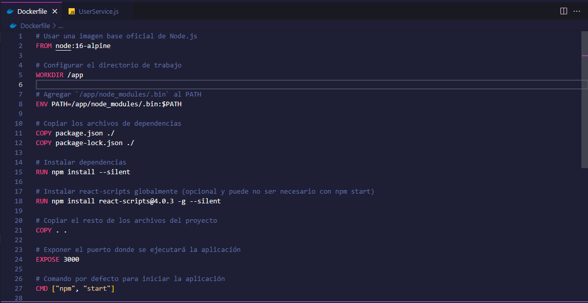
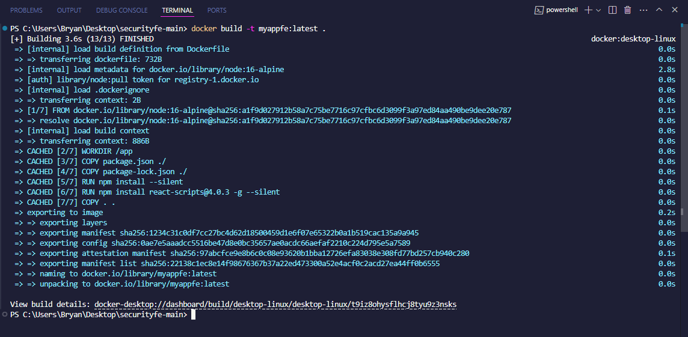
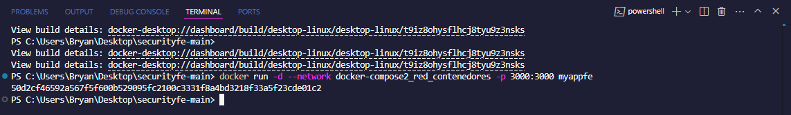
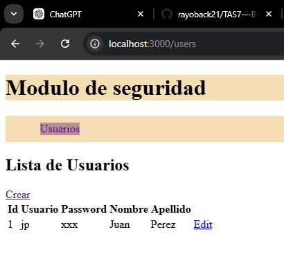

# **_Informe de dos contenedores y proyecto con Spring Boot_**

## **_2. Tiempo_**
**20 minutos**

## **_3. Fundamentos_**

### **_3.1 Docker_**
Docker es una herramienta que permite empaquetar aplicaciones junto con todas sus dependencias dentro de contenedores ligeros. A diferencia de las máquinas virtuales, los contenedores comparten el núcleo del sistema operativo, lo que los hace más eficientes.

- **Imagen**: Una imagen contiene las instrucciones necesarias para configurar y ejecutar un contenedor.

### **_3.2 Spring Boot_**
Spring Boot es un framework basado en Spring, diseñado para facilitar la configuración y el despliegue de aplicaciones en Java. Su objetivo es simplificar el desarrollo mediante el uso de configuraciones predeterminadas y dependencias integradas.

### **_3.3 YAML_**
YAML es un formato estándar para configurar aplicaciones de manera más rápida y comprensible. Su sintaxis limpia lo hace fácil de leer e interpretar, facilitando la colaboración entre desarrolladores.

## **_4. Conocimientos previos_**
Para realizar esta práctica es necesario contar con:

- Conocimientos de Docker.
- Docker instalado.
- Habilidad para usar la terminal.
- Acceso a un navegador web.
- Conexión a internet.
- Comprensión básica de puertos.
- Familiaridad con la documentación de Docker.
- Conocimiento de archivos YAML.

## **_5. Objetivos a alcanzar_**
El objetivo principal de esta práctica es aprender a configurar y desplegar un entorno en Docker que incluya una base de datos PostgreSQL y un proyecto de Spring Boot, asegurando su correcta conexión.

## **_6. Equipo necesario_**

- Computador.
- Navegador web.
- Docker instalado.
- Proyecto de Spring Boot.

## **_7. Material de apoyo_**

- Documentación de Docker.
- Guía de asignatura.
- Imágenes de Docker.
- Proyecto creado.

## **_8. Procedimiento_**.

 

 
  
  

 

